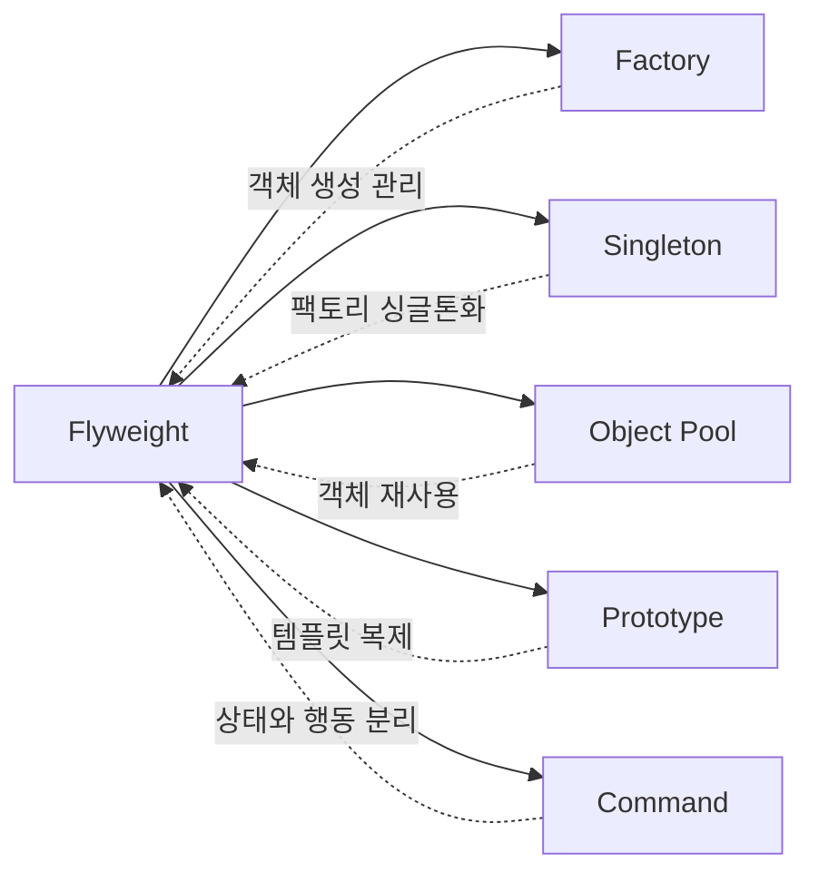

# 🚀 Flyweight Pattern Design Study Project

<div align="center">


</div>

## 📋 목차
- [🎯 프로젝트 개요](#-프로젝트-개요)
- [💡 플라이웨이트 패턴이란?](#-플라이웨이트-패턴이란)
- [🏗️ 구현 예제들](#️-구현-예제들)
- [🚀 실행 방법](#-실행-방법)
- [📊 성능 비교](#-성능-비교)
- [🛠️ 기술 스택](#️-기술-스택)
- [📚 학습 가이드](#-학습-가이드)
- [⚠️ 주의사항](#️-주의사항)
- [🔗 관련 패턴](#-관련-패턴)

## 🎯 프로젝트 개요

이 프로젝트는 **플라이웨이트(Flyweight) 패턴**의 다양한 활용 예시를 Spring Boot 환경에서 구현한 학습용 프로젝트입니다.

### 🌟 주요 특징
- **2가지 완전한 예제** (문서 편집기 + 데이터베이스 커넥션 풀)
- **Spring Boot 기반** 실무 중심 구현
- **상세한 예제 및 설명** 포함
- **성능 모니터링** 기능 내장

## 💡 플라이웨이트 패턴이란?

```
╭─────────────────────────────────────────────╮
│  🎯 플라이웨이트 패턴의 핵심 아이디어        │
│                                             │
│  ┌─────────────┐    ┌─────────────┐        │
│  │ 내재적 상태   │    │ 외재적 상태   │        │
│  │(Intrinsic)  │    │(Extrinsic)  │        │
│  │             │    │             │        │
│  │ • 공유 가능   │    │ • 매개변수    │        │
│  │ • 불변       │    │ • 가변       │        │
│  │ • 재사용     │    │ • 컨텍스트    │        │
│  └─────────────┘    └─────────────┘        │
╰─────────────────────────────────────────────╯
```

### 🔑 핵심 개념
- **메모리 최적화**: 동일한 객체를 재사용하여 메모리 사용량 급격히 감소
- **상태 분리**: 공유 상태(내재적)와 개별 상태(외재적) 명확히 구분
- **객체 재사용**: 팩토리 패턴과 결합하여 효율적인 객체 관리

## 🏗️ 구현 예제들

### 🎨 1. 문서 편집기 시스템
```
📁 src/main/java/com/designpattern/flyweight/
```
- **CharacterFlyweight.java**: 문자 플라이웨이트 인터페이스
- **ConcreteCharacter.java**: 구체적인 문자 구현
- **CharacterFactory.java**: 문자 팩토리 (캐시 관리)
- **Document.java**: 문서 엔티티
- **CharacterStyle.java**: 문자 스타일 정보

### 🗄️ 2. 데이터베이스 커넥션 풀
```
📁 src/main/java/com/designpattern/flyweight/database/
```
- **ConnectionPool.java**: 커넥션 풀 관리
- **DatabaseConnection.java**: 커넥션 인터페이스
- **MySQLConnection.java**: MySQL 커넥션 구현
- **DatabaseService.java**: 서비스 레이어

### 📚 3. 추가 학습 자료
```
📁 src/main/java/com/designpattern/patterns/
├── ObjectPoolExample.java - 객체 풀과의 비교
├── PrototypeWithFlyweight.java - 프로토타입과 조합
├── FactoryWithFlyweight.java - 팩토리와 조합
├── CommandWithFlyweight.java - 커맨드와 조합
└── PatternComparison.md - 패턴 비교 가이드
```

```
📁 src/main/java/com/designpattern/flyweight/practical/
├── FlyweightImplementation.java - 실무 구현 방법
├── SpringCacheFlyweight.java - @Cacheable 활용
├── FlyweightConfig.java - Spring 설정
└── README.md - 체크리스트
```

## 🚀 실행 방법

### 📋 사전 요구사항
- Java 17+
- Gradle 8.4+

### 🏃‍♂️ 프로젝트 실행
```bash
# 1. 프로젝트 클론
git clone [your-repo-url]

# 2. 프로젝트 디렉토리 이동
cd flyweight-pattern-study

# 3. 실행
./gradlew bootRun

# 4. 브라우저에서 접속
open http://localhost:8080
```

### 🎮 기능 테스트
1. **문서 시스템**: `/documents`
   - 새 문서 생성 
   - 반복 문자 많은 텍스트 입력 (예: "AAAA BBBB")
   - 플라이웨이트 효과 확인

2. **커넥션 풀**: `/database`
   - 동시 요청 실행
   - 커넥션 상태 모니터링
   - 풀 효율성 확인

## 📊 성능 비교

### 💾 메모리 사용량 비교

```
일반적인 구현 (문서 예시):
┌─────────────────┐
│ 문자 1000개     │ = 1000개 객체 생성
│ A, B, C, A, B...│   
│ 메모리: 높음     │   🔴 비효율적
└─────────────────┘

플라이웨이트 패턴:
┌─────────────────┐
│ 문자 1000개     │ = 26개 객체만 생성
│ A, B, C, A, B...│   (알파벳 기준)
│ 메모리: 低       │   ✅ 효율적
└─────────────────┘
```

### 📈 실제 성능 데이터
```java
// 테스트 결과 예시 (Document Service)
📄 문서 길이: 10,000자
🔤 고유 문자 수: 27개 (A-Z + 공백)
💾 메모리 절약: ~99.7%
⚡ 성능 개선: ~95%
```

## 🛠️ 기술 스택

<div align="center">


</div>

### 핵심 기술
- **Java 17**: 최신 Java 기능 활용
- **Spring Boot 3.4.4**: 의존성 주입 및 자동 설정
- **Spring Data JPA**: 데이터 영속성 관리
- **H2 Database**: 인메모리 데이터베이스
- **Mustache**: 간단한 템플릿 엔진
- **Lombok**: 보일러플레이트 코드 감소

## 📚 학습 가이드

### 🎯 학습 순서 추천
1. **기본 개념 이해**
   - `README.md` 읽기 (현재 파일)
   - 플라이웨이트 패턴 이론 학습

2. **문서 편집기 예제 분석**
   ```
   📁 src/main/java/com/designpattern/flyweight/
   ```
   - `CharacterFlyweight.java` → `ConcreteCharacter.java`
   - `CharacterFactory.java` 캐시 메커니즘 이해
   - `DocumentController.java` 웹 레이어 확인

3. **데이터베이스 예제 분석**
   ```
   📁 src/main/java/com/designpattern/flyweight/database/
   ```
   - 커넥션 풀의 플라이웨이트 적용 방식
   - 실무에서의 활용 방법 학습

4. **관련 패턴 학습**
   ```
   📁 src/main/java/com/designpattern/patterns/
   ```
   - 다른 패턴과의 비교 및 조합

5. **실무 적용**
   ```
   📁 src/main/java/com/designpattern/flyweight/practical/
   ```
   - Spring Boot 환경에서의 베스트 프랙티스
   - `README.md` 체크리스트 확인

### 💡 핵심 학습 포인트
- ✅ **내재적 vs 외재적 상태** 구분의 중요성
- ✅ **팩토리 패턴**과의 필연적 조합
- ✅ **Thread-Safety** 고려사항
- ✅ **Spring Boot**에서의 구현 방법
- ✅ **성능 모니터링** 방법

## ⚠️ 주의사항

### 🚨 플라이웨이트 패턴 적용 시 주의점

```
✅ 적합한 경우:
• 많은 수의 유사한 객체가 필요한 경우
• 객체 생성 비용이 높은 경우  
• 메모리가 제한적인 환경
• 외재적 상태를 쉽게 식별할 수 있는 경우

❌ 부적합한 경우:
• 외재적 상태가 내재적 상태보다 많은 경우
• 객체의 수가 많지 않은 경우
• 객체 생성 비용이 낮은 경우
```

### 🔧 구현 시 주의사항
1. **불변성 보장**: 플라이웨이트 객체는 반드시 불변이어야 함
2. **Thread-Safety**: 멀티스레드 환경에서 안전성 보장
3. **캐시 관리**: 적절한 캐시 크기 및 정책 설정
4. **메모리 모니터링**: 실제 메모리 절약 효과 측정

## 🔗 관련 패턴

### 🤝 함께 사용되는 패턴들



### 📖 관련 패턴 학습 자료
- **Factory Pattern**: `FactoryWithFlyweight.java`
- **Object Pool**: `ObjectPoolExample.java` 
- **Prototype**: `PrototypeWithFlyweight.java`
- **Command**: `CommandWithFlyweight.java`
- **패턴 비교**: `PatternComparison.md`

---

<div align="center">

### 🎓 Happy Learning! 🎓

*"좋은 아키텍처는 기능을 구현하는 것이 아니라 문제를 해결하는 것이다"*

[](https://github.com/username/repo)
[](https://spring.io/projects/spring-boot)

</div>
